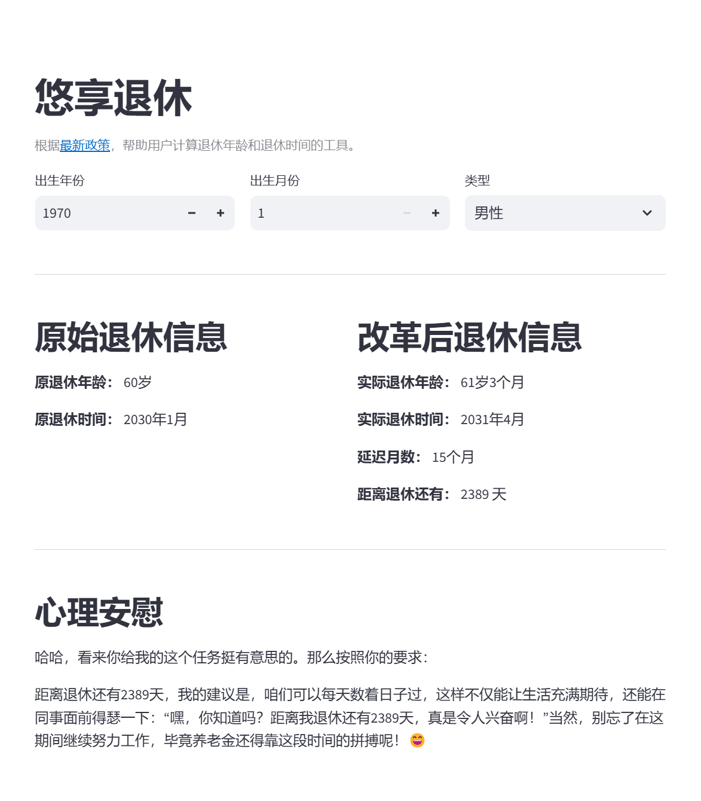

# Retirement Calculator

This project is a web-based retirement calculator that helps users determine their retirement age and date based on their birth year, birth month, and type (male, female worker, or female cadre). The project is built using Streamlit for the frontend and includes an integration with the ZhipuAI API for generating comforting words for users.



## Features

- Calculate retirement age and date based on user input.
- Display original and actual retirement information.
- Generate comforting words for users experiencing delayed retirement.

## Installation

1. Clone the repository:

   ```bash
   git clone https://github.com/gandli/retirement-calculator.git
   cd retirement-calculator
   ```

2. Create and activate a virtual environment:

   ```bash
   python -m venv .venv
   .\.venv\Scripts\activate  # Windows
   # or
   source .venv/bin/activate  # Linux/macOS
   ```

3. Install the dependencies:

   ```bash
   pip install -r requirements.txt
   ```

4. Add your ZhipuAI API key to a `.env` file in the project root:

   ```plaintext
   ZHIPUAI_API_KEY=your_api_key_here
   ```

## Usage

1. Run the Streamlit app:

   ```bash
   streamlit run app.py
   ```

2. Open your web browser and go to `http://localhost:8501` to use the retirement calculator.

## Project Structure

```plaintext
retirement-calculator/
├── .venv/
├── app.py
├── requirements.txt
├── .env
└── README.md
```

## Contributing

1. Fork the repository.
2. Create a new branch (`git checkout -b feature-branch`).
3. Commit your changes (`git commit -m 'Add some feature'`).
4. Push to the branch (`git push origin feature-branch`).
5. Open a Pull Request.

## License

This project is licensed under the MIT License.

## Acknowledgments

- [Streamlit](https://streamlit.io/)
- [ZhipuAI](https://zhipu.ai/)